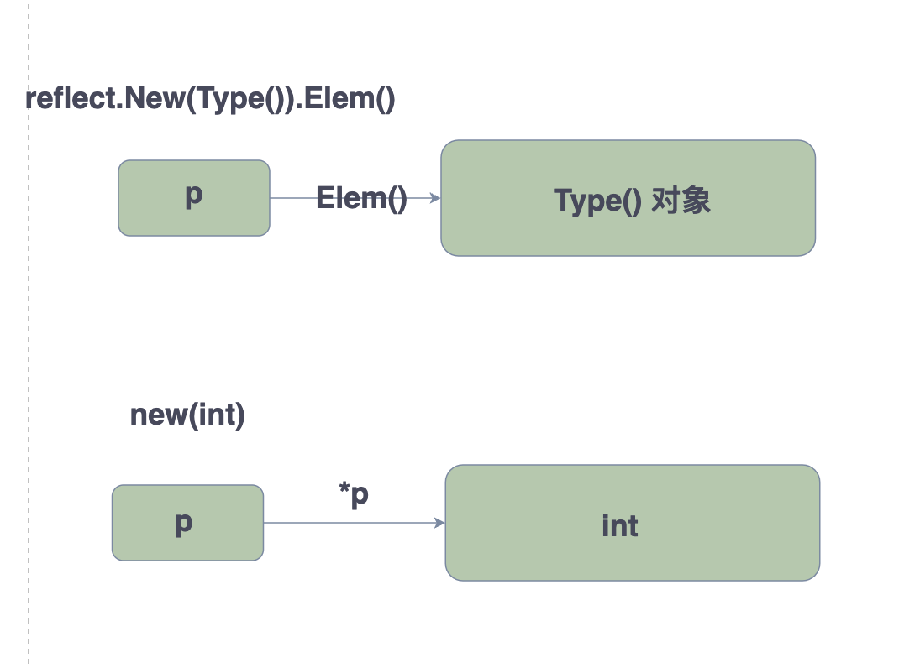
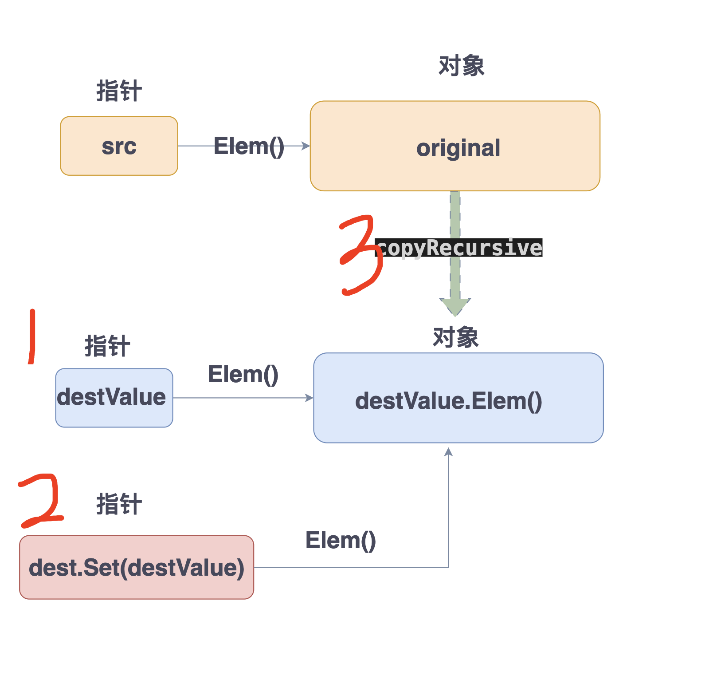

# Golang实现自己的深拷贝

作为CRUD成员，是不是平时reflect使用的很少，一旦使用又不知道如何操作，通过学习本项目，加深对reflect理解。代码就是100行

项目托管地址：

通过本项目可以学到什么？

- reflect各种基本使用
- 加深对各种数据类型的理解


## 理解的重点：

>`reflect.ValueOf()`

表示将`interface{}`转成 `reflect.Value`结构体,这两个是等价的关系，`reflect.Value`的底层就是基于 `interface{}`。我们知道接口类型包含两个：动态类型和动态值，通过`reflect.Value`可以方便的获取这两个值。


>`reflect.New(origianl.Type()).Elem()`

表示基于类型，`new`了一个该类型的指针，同时通过解引用`Elem()`该指针，得到该类型的对象。通过下图对比理解：



> 以这段代码作为理解范例：
```go
func copyRecursive(src, dest reflect.Value) {

	switch src.Kind() {
    case reflect.Ptr: // 说明src是一个指针，不能直接将指针复制给dest；如果直接复制，src和dest就指向了同一个地址（就不算是深拷贝）
		original := src.Elem() // 指针指向的类型
		if src.IsNil() || !original.IsValid() {
			return
		}
		// 所以这里构造了一个新地址
		destValue := reflect.New(original.Type())

		// 这里将 original的值复制给 v.Elem()
		copyRecursive(original, destValue.Elem())
		// 让dest指向这个新地址
		dest.Set(destValue)
    }

    ....省略...
}

```
`copyRecursive` 函数定义：将src的值，赋值给dest

- src为指针类型，dest也是指针类型；我们可以直接 `dest.Set(src)`,这个的含义就是将src的值赋值给dest，达到目的。但是一个指针a赋值给指针b，此时a和b指向的是同一个对象，并没有达到深拷贝的目的。【所以不行】
- 所以我们需要新建一个对象，让dest指针指向这个新对象，即可。那这个新对象的类型是什么？不就是 src指针指向的对象的类型嘛。。`original := src.Elem()`就获取到src指针指向的对象，类型那就是 `original.Type()`.
- 所以新建的对象指针为 `destValue := reflect.New(original.Type())`,这个是不是很类似于C语言中的 `int *p = new(int)`
- 接下来，那就是让dest指向这个新指针即可 `dest.Set(destValue)`就是赋值的意思
- 虽然我们`new`了新对象，并且指向了该对象，但是该新对象的值其实都是初始值的 0值。所以需要继续调用`copyRecursive`函数，将`original`对象的值，复制给 `destValue.Elem()`对象

